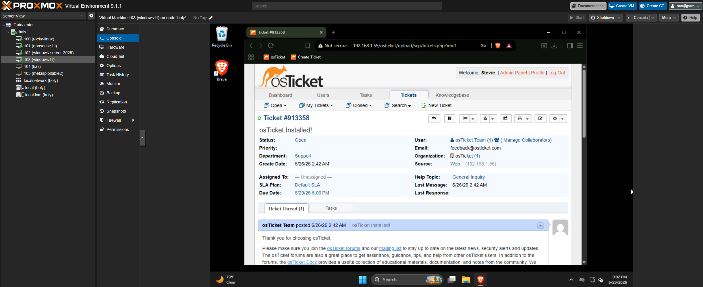
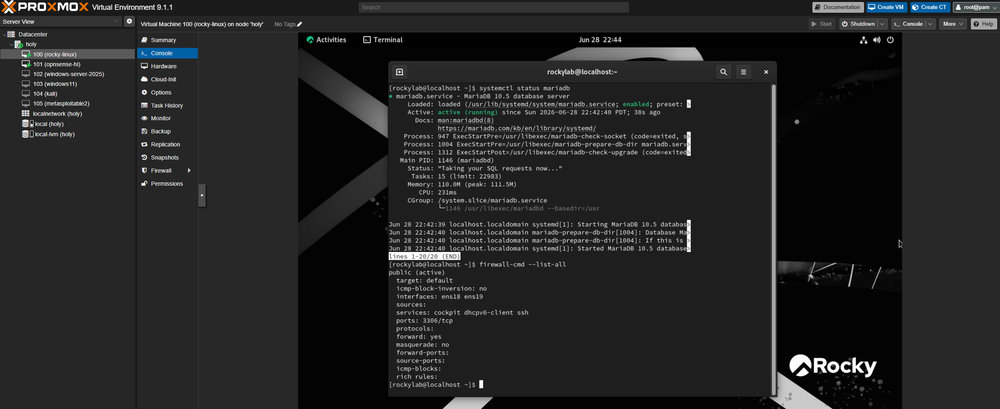
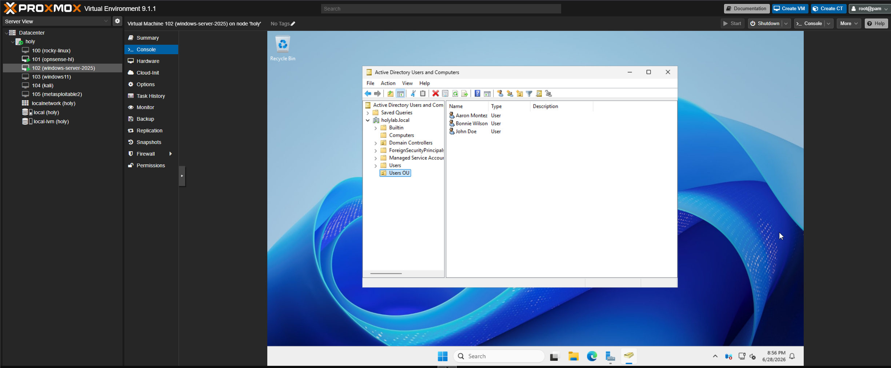
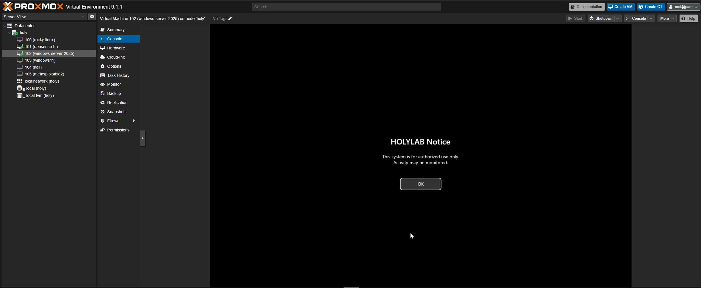
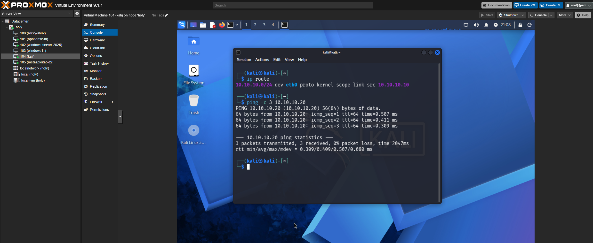

# holylab.local — Enterprise Home Lab

A documented enterprise-style home lab built on a Dell OptiPlex 3040 running Proxmox VE. This project covers core IT infrastructure, help desk services, Active Directory administration, and a segmented security lab — built as a portfolio project targeting IT support and cybersecurity analyst roles.

> ⚠️ **Lab Environment Only**
> All systems in this lab are self-owned and self-managed.
> The security lab subnet is air-gapped with no physical NIC uplink.
> Do not replicate offensive techniques against systems you do not own or have explicit permission to test.

---

## What's Built

| Phase | Component | Status |
|---|---|---|
| Phase 1 | Proxmox VE · OPNsense Firewall · WireGuard VPN | ✅ Complete |
| Phase 2 | IIS · PHP 8.5 NTS · MariaDB · osTicket v1.18.4 | ✅ Complete |
| AD Build-Out | OUs · Domain Users · Group Policy · Domain Join | ✅ Complete |
| Phase 3 | Kali Linux · Metasploitable 2 · Air-gapped Subnet | ✅ Complete |

---

## Lab Architecture

| VM | Role | IP |
|---|---|---|
| OPNsense | Firewall / LAN Gateway / VPN endpoint | `<GW-IP>` |
| Windows Server 2025 | Active Directory DC + DNS | `<DC-IP>` |
| Rocky Linux 9.8 | MariaDB database tier | `<DB-IP>` |
| Windows 11 | IIS web server + PHP + osTicket | `<WEB-IP>` |
| Kali Linux | Penetration testing VM (isolated subnet) | `<KALI-IP>` |
| Metasploitable 2 | Intentionally vulnerable target | `<TARGET-IP>` |

**Network layout:**

| Bridge | Purpose |
|---|---|
| `vmbr0` | WAN uplink |
| `vmbr1` | LAN — all production VMs |
| `vmbr2` | Air-gapped security subnet — no physical NIC attached |

---

## Phase 1 — Core Infrastructure

- Proxmox VE installed on bare metal with dual Linux bridge networking
- OPNsense deployed as the LAN firewall and gateway
- WireGuard VPN configured for remote access with port forwarding through OPNsense
- Static IPs assigned to all VMs across the LAN subnet

---

## Phase 2 — Help Desk Services

- IIS deployed on Windows 11 with an HTTPS binding using a self-signed certificate
- PHP 8.5 NTS wired to IIS via FastCGI — manually configured (no Web Platform Installer)
- MariaDB hosted on Rocky Linux in a split-tier architecture — web tier on Windows, DB tier on Linux
- osTicket v1.18.4 installed and fully configured: ticket workflows, staff accounts, departments, and cron scheduling via Windows Task Scheduler

**Screenshot — osTicket running on IIS:**

**Screenshot — MariaDB running on Rocky Linux (DB tier):**

---

## Active Directory Build-Out

- Active Directory Domain Services configured on Windows Server 2025
- Domain: `holylab.local`
- Organizational Units: `Users`, `Computers`
- Domain users created and placed in OUs: Doe, Montez, Wilson
- Windows 11 workstation domain-joined and confirmed in the Computers OU
- Group Policy Objects applied:
  - Password policy (10-char minimum, complexity enabled, 90-day max age, 5-password history)
  - Login banner enforced across the domain
- End-to-end domain login verified on the workstation

**Screenshot — AD Users and Computers:**

**Screenshot — GPO login banner enforced on domain controller:**

---

## Phase 3 — Security Lab

- `vmbr2` created in Proxmox as an air-gapped bridge with no physical NIC uplink — structurally isolated regardless of firewall rules
- Kali Linux deployed on the isolated subnet for penetration testing
- Metasploitable 2 imported as the intentionally vulnerable target — IDE controller required for proper boot
- Isolation verified: no routes to the production LAN or WAN, pings to the gateway time out

**Screenshot — Kali isolation check:**

---

## Skills Demonstrated

- Hypervisor administration (Proxmox VE)
- Network segmentation and firewall configuration (OPNsense)
- VPN setup and remote access (WireGuard)
- Windows Server administration (Active Directory, DNS, GPOs)
- Web server deployment (IIS, PHP FastCGI, self-signed TLS)
- Split-tier application architecture (IIS → MariaDB over LAN)
- Help desk platform administration (osTicket, ticket lifecycle management)
- Linux server administration (Rocky Linux, firewalld, systemd, MariaDB)
- Security lab design and network isolation
- Penetration testing environment setup (Kali Linux, Metasploitable 2)
- IT documentation and runbook writing (Markdown, Git)
- Ticketing system administration and workflow management (osTicket)

